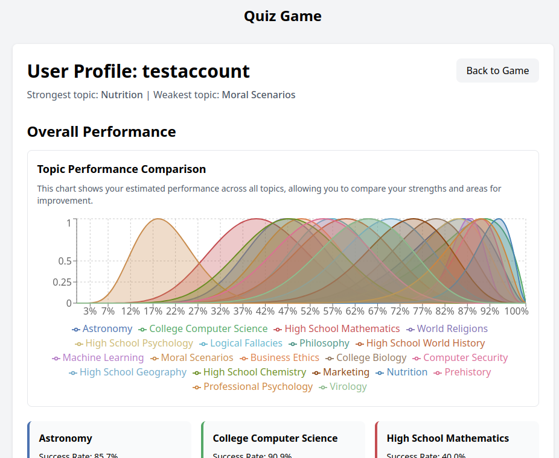
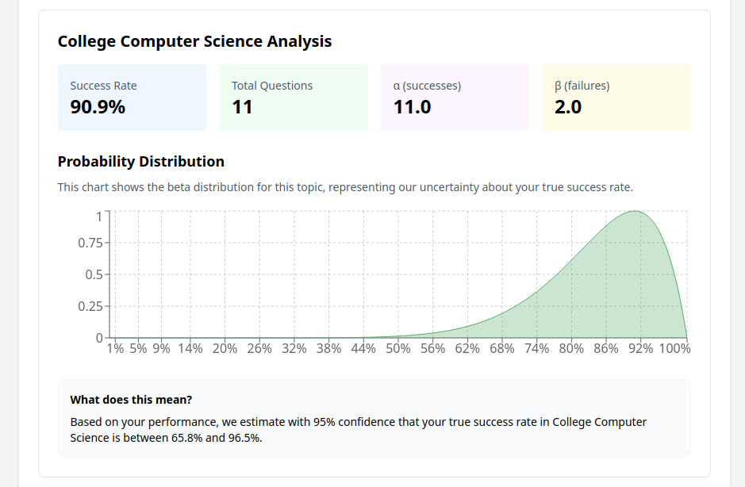
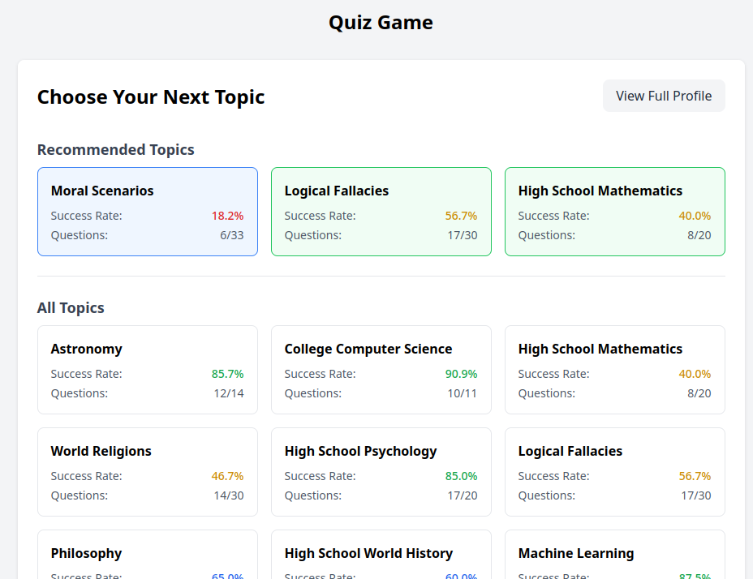
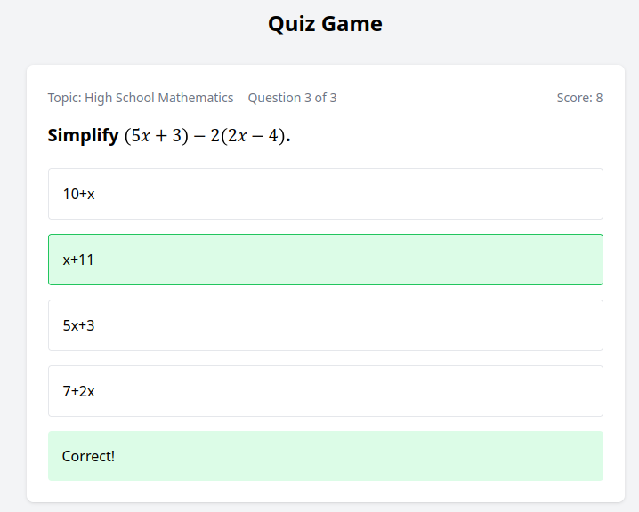

# Quiz Game

An adaptive quiz game powered by the HuggingFace MMLU dataset, featuring intelligent category selection and progress tracking.

## Features

- Questions from the [HuggingFace MMLU dataset](https://huggingface.co/datasets/cais/mmlu) with:
  - 20 diverse categories
  - 25 questions per category
  - Full LaTeX support for mathematical expressions
- Adaptive difficulty using Thompson sampling with beta distribution
- User profiles with detailed category progress tracking
- Interactive sound effects for enhanced engagement

## Screenshots







## How to Play

:video-game: [Play now on Vercel!](https://vercel.com/paul-lamberts-projects/pixijs-mmlu-trivia-game)

1. Create an account or log in
2. Select a category or let the system recommend one based on your progress
3. Answer questions and track your improvement
4. Use `testaccount` to explore the interface with pre-populated data


### Launch locally

```bash
# Clone the repository
git clone https://github.com/hipml/pixijs-mmlu-trivia-game.git

# Install dependencies
npm install

# Start the development server
npm run dev
```

## License

This project is licensed under the MIT license - see LICENSE.txt for details
